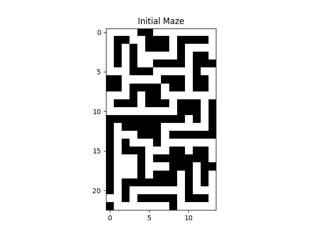
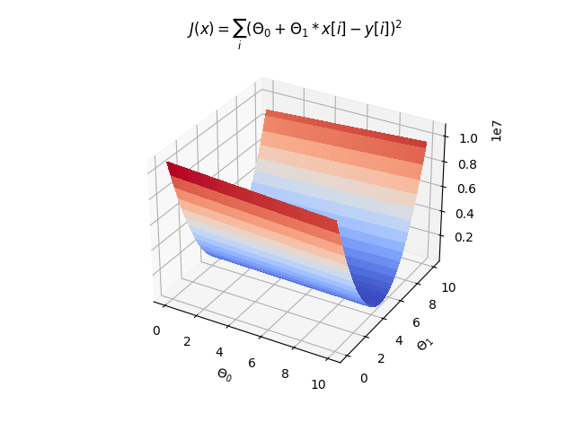
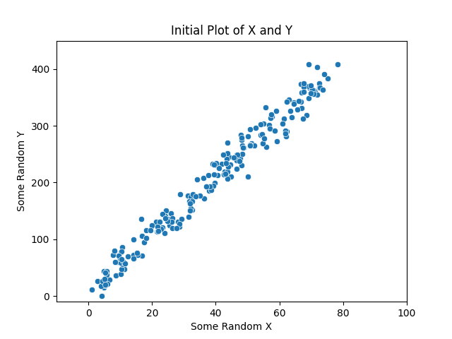
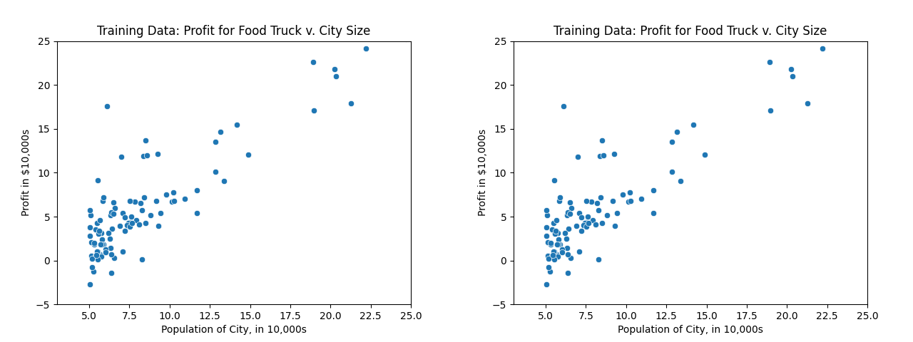
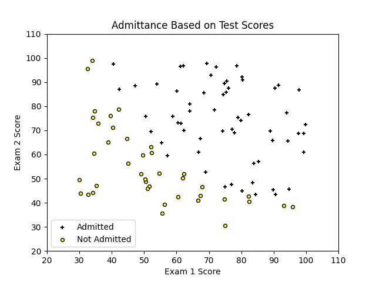
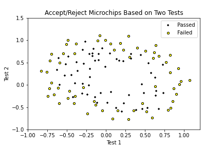
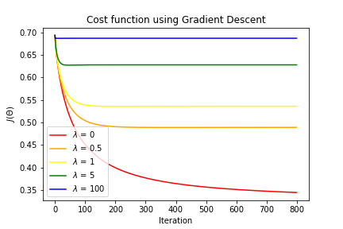
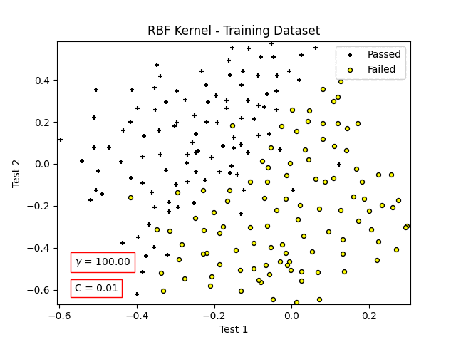
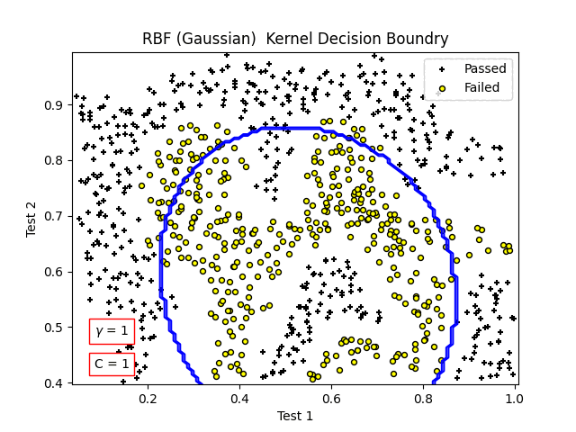
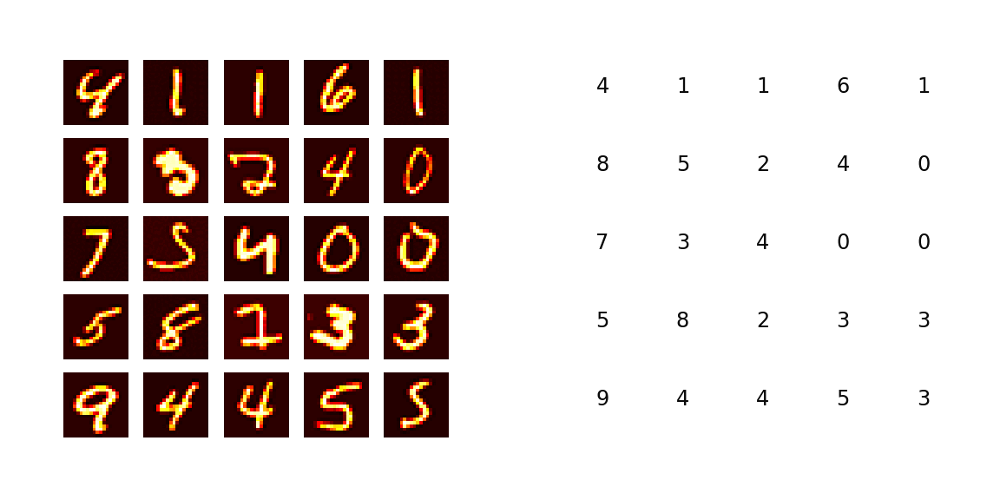

# Coding Practice

Source code for various algorithm implementations 

## kmeans
 c++ implementation of kmeans clustering algorithm 

 

## meanshift
 c++ implementation of the mean shift clustering algorithm
  
   

## maze solver
 python implementation to find the minimum number of steps to complete a maze
 
    

## MachineLearning
 CS 229 - Machine Learning, Stanford \
 course by Andrew Ng
 
 ### Gradient Descent
  python implementations of Batch Gradient Descent: 
  
   
  
    
  
    
  
  ### Logistic Regression
  2D feature vector (mapped to 6th order polynomial) with linear and nonlinear boundaries \
  best fit found using gradient descent
  
 
   
  
      

  ### Support Vector Machine
  Optimal Margin Classifier + Kernel Trick = Support Vector Machine
  
  L1 Norm Soft Margin Support Vector Machine

      

### Neural Network - Handwritten Number Recognition

  

## datagenerator
 code to generate fake datasets
 - normal distributions
 - gaussian jitter along a line

## bitwise operations
 c++ examples of functions executing bitwise operations 
 - logical operators
 - right/left shift div/mult by 2
 - & 1 for odd/even
 - XOR find singly-occurring element in array

## recursion
 c++ examples of recursive fucntions 
 - write number in binary
 - calculate compound interest minus a commission
   after some set time
 - count up and down from min to max
 - calculate factorial
 - find the maximum number in an array
 - sort an array from min to max (selection sort)
 - find the sum of all numbers between a and b

## sorting
 python examples of sorting algorithms
 - quicksort
 - bubblesort
 - mergesort

 ## hash sets
  python implementation of a hash set, then using the hash set to solve a few problems
  - check if an array contains any duplicate numbers
  - find the intersection of two arrays
  - determine if an integer is "happy" (number theory definition) 
    https://en.wikipedia.org/wiki/Happy_number

 ## Project Euler
 Solutions to questions from https://projecteuler.net/
 1. Sum of multiples of 3 or 5 < 1k :: 233168
 2. Sum of even Fibinocci numbers < 4M :: 4613732
 3. Largest prime factor of 600851475143 :: 6857
 4. Largest palindrome made from the product of two 3-digit numbers: 913 x 993 = 906609
 5. Smallest positive number that is evenly divisible by all of the numbers from 1 to 20 :: 232792560
  - It has a prime factorization of [1, 2, 3, 2, 5, 7, 2, 3, 11, 13, 2, 17, 19]
 6. Difference between the sum of the squares of the first one hundred natural numbers and the square of the sum :: 25164150
 7. The 10001st prime number :: 104743
 8. Given a 1000-digit number, find the group of 14 sequential numbers with largest product :: 23514624000
 9. There exists exactly one Pythagorean triplet for which a + b + c = 1000. Find the product abc. :: 200 x 375 x 425 = 31875000
 10. Sum of all primes less than 2M :: 142913828922
