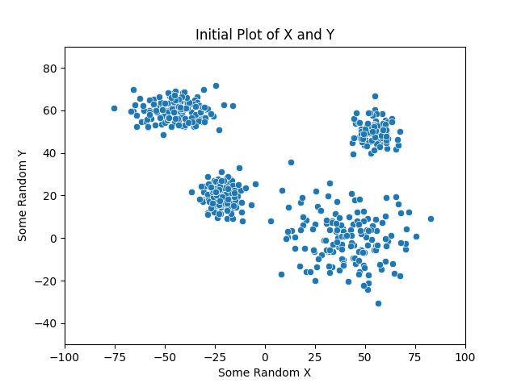

# Coding Practice

Source code for various algorithm implementations 

## bitwise operations
 example of functions executing bitwise operations 
 - logical operators
 - right/left shift div/mult by 2
 - & 1 for odd/even
 - XOR find singly-occurring element in array

## recursion
 examples of recursive fucntions 
 - write number in binary
 - calculate compound interest minus a commission
   after some set time
 - count up and down from min to max
 - calculate factorial
 - find the maximum number in an array
 - sort an array from min to max (selection sort)
 - find the sum of all numbers between a and b

## kmeans
 implementation of kmeans clustering algorithm 
  - includes python plotting script

 

 run `./compkmeans` to compile c++ file \
 then `./kmeans` to run algorithm \
 then `python makeplot.py` to make the plots

## meanshift
 implementation of the mean shift clustering algorithm \
  -includes python plotting script
  
  
 

 

 run `./compmeanshift.sh` to compile c++ file \
 then `./meanshift` to run algorithm \
 then `python makeplot.py` to make the plots

## datagenerator
 code to generate fake datasets
 - normal distributions
 - gaussian jitter along a line

## MachineLearning
 CS 229 - Machine Learning, Stanford \
 course by Andrew Ng
 
  
