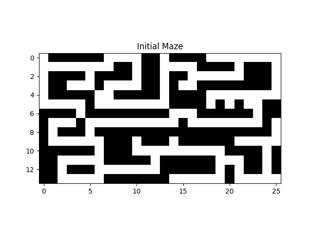

# Coding Practice

Source code for various algorithm implementations 

## kmeans
 c++ implementation of kmeans clustering algorithm 

 

## meanshift
 c++ implementation of the mean shift clustering algorithm
  
   

## maze solver
 python implementation to find the minimum number of steps to complete a maze
 
    

## MachineLearning
 CS 229 - Machine Learning, Stanford \
 course by Andrew Ng
 
 ### Gradient Descent
  python implementations of Batch Gradient Descent: 
  
   
  
    
  
    
  
  ### Logistic Regression
  2D feature vector (mapped to 6th order polynomial) with linear and nonlinear boundaries \
  best fit found using gradient descent
  
 
   
  
      

  ### Support Vector Machine
  Optimal Margin Classifier + Kernel Trick = Support Vector Machine
  
  L1 Norm Soft Margin Support Vector Machine

      

## datagenerator
 code to generate fake datasets
 - normal distributions
 - gaussian jitter along a line

## bitwise operations
 c++ examples of functions executing bitwise operations 
 - logical operators
 - right/left shift div/mult by 2
 - & 1 for odd/even
 - XOR find singly-occurring element in array

## recursion
 c++ examples of recursive fucntions 
 - write number in binary
 - calculate compound interest minus a commission
   after some set time
 - count up and down from min to max
 - calculate factorial
 - find the maximum number in an array
 - sort an array from min to max (selection sort)
 - find the sum of all numbers between a and b

